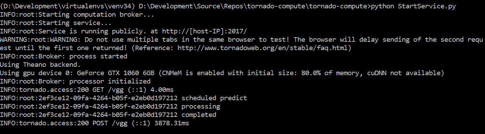

# Introduction
Sample application for building a [**`tornado`**](http://www.tornadoweb.org/)-powered webservice that feeds input to a [**`Keras`**](http://keras.io) model on a second process. Handlers of the webservice remain asynchronous, therefore it stays responsive.

## What this is
A primer to show you how to serve any *Keras* model as a webservice. Here we take VGG-16, but any other model works fine too.

Most importantly, we will achieve this **without writing a single line of C++**. Here are a few reasons why you'd **not** want to do this with C++:
+ cross-platform compatibility
+ combination with `skimage`, `sklearn` or any other Python modules
+ develop and deploy with the same language

## What this is NOT
This is not something that magically knows and does what you want. You managed to build a neural network, but to serve it in a webservice, you are expected to write a few more lines of Python.

You are in charge of the API endpoints, feeding inputs to your model and serving responses. This application will merely show you the architecture by example.


# How to get going
## What you bring to the party
This tutorial assumes that you...
+ already have a Python environment running *Keras* (preferably on GPU)
+ you want to keep using Python for deployment

Now there are some things you probably don't have installed yet. But don't worry, you can install them via `pip`:

```bash
pip install tornado
pip install dualprocessing
pip install keras_vgg_buddy
```

Why do we need these?
+ [**`tornado`**](http://www.tornadoweb.org/) is a webserver that we'll use to create the webservice. It's highly scalable and built for performance.
+ [**`dualprocessing`**](https://github.com/michaelosthege/dualprocessing) is a module I built for running a thread-blocking computation pipeline on a second process.
+ [**`keras_vgg_buddy`**](https://github.com/awentzonline/keras-vgg-buddy) is there to help with loading VGG from the weights file and converting class index to class label

Finally, **you need to provide a trained VGG-16 model** as a HDF5-file. You can download it from [here](https://drive.google.com/file/d/0Bz7KyqmuGsilT0J5dmRCM0ROVHc/view).

If you know a URL where this file can be downloaded directly, you can provide it as a parameter.


## How does it work?
Before the service is started, a `dualprocessing.Broker` is created. It will run a user-provided constructor (`makePipeline`) on a new thread to create one instance of the computation `Pipeline`.

The `Broker` uses a pipe connection to schedule calls to the computation pipeline. Each call is identified by a unique key. When a it comes in, it is passed through the pipe to the backend computation process. A loop at the other end of the pipe sequentially does the (blocking) prediction calls, while the main thread asynchronously waits for the response to be returned through the pipe.

**Pipeline.py**: user-provided class that will live on the second process

**StartService.py**: runs the webserver and remains responsive at all times

**Broker**: handles process creation and asynchronous scheduling/execution

If you're interested in the details of the [**`dualprocessing`**](https://github.com/michaelosthege/dualprocessing) module, have a look at its GitHub page.

## How do I run it?
After you have completed this checklist, just run `StartService.py` as shown below.

* [ ] installed all dependencies
* [ ] [`vgg16_weights.h5`](https://drive.google.com/file/d/0Bz7KyqmuGsilT0J5dmRCM0ROVHc/view) downloaded to project directory

```bash
python StartService.py
```

It should look something like this:



Now you can point your browser to [http://localhost:2017/vgg](http://localhost:2017/vgg). 

Alternatively you can POST a URL pointing to an image to http://localhost:2017/vgg

The first time you do this, the VGG model will be compiled to work with CUDA, so expect some delay. Subsequent requests will process within sub-second delays.

# The Code
Let's take a look at some of the most important lines.

## Webservice
The endpoints of the webservice are implemented as classes. In the `endpoints` list, we set up at which URL a certain endpoint will be available. This is standard *tornado* practice and in fact very similar to *Flask*.

```python
endpoints = [
    (r"/", Landing),
    (r"/vgg", VGG)
]
```

In `StartService.py` we also define a method for initialization of the computation pipeline (that runs the neural net).

```python
def makePipeline():
    """Will be executed from the secondary process. Imports and constructs the computation environment."""
    import Pipeline
    processor = Pipeline.Pipeline("vgg16_weights.h5")
    return processor
```

The `computationBroker` from the `dualprocessing` module will call this on the second thread to create an instance of our computation pipeline.

In the `VGG` endpoint, we accept HTTP GET to serve an HTML template with a simple form. The user can then put a URL into the form and POST it to the `/vgg` endpoint.

The `url` parameter is passed to a `dualprocessing.AsyncCall` object which is submitted to the `computationBroker`.

```python
class VGG(tornado.web.RequestHandler):
    """POST a URL of an image to this address to run it through VGG-16."""
    def get(self):
        self.render('templates/vgg.html')

    @tornado.gen.coroutine
    def post(self):
        try:
            url = self.get_argument("url", None)
            if (not url):   # take a default image
                url = "https://upload.wikimedia.org/wikipedia/commons/thumb/4/4d/Serpent_roi_bandes_grises_01.JPG/300px-Serpent_roi_bandes_grises_01.JPG"
            call = dualprocessing.AsyncCall("predict", url=url)
            response = yield computationBroker.submit_call_async(call)
            if (response.Success):
                self.write(response.Result)
            else:
                raise response.Error
        except:
            def lastExceptionString():
                exc_type, ex, exc_tb = sys.exc_info()
                fname = os.path.split(exc_tb.tb_frame.f_code.co_filename)[1]
                return "{0} in {1}:{2}".format(ex, fname, exc_tb.tb_lineno)
            exmsg = lastExceptionString()
            logging.critical(exmsg)
            self.write(exmsg)
```

## Pipeline
In [`Pipeline.py`](/tornado-compute/blob/master/tornado-compute/Pipeline.py), the model is loaded upon initialization.

*Side Note*: The GoogleDrive does not allow hotlinking, so you have to download it manually..

```python
class Pipeline(object):
    """Takes care of running computations."""
    def __init__(self, weights_path="vgg16.hdf5", download_from="https://docs.google.com/uc?id=0Bz7KyqmuGsilT0J5dmRCM0ROVHc&export=download"):
        """ ... """
        # load the model
        self.VGG = self.get_vgg(weights_path, download_from)
        return
```

In the `predict` method, images are downloaded and fed to the VGG network:

```python
    def predict(self, url):
        ############## Prepare input
        # download the image
        filename = "temp" + os.path.splitext(url)[1]
        urllib.request.urlretrieve(url, filename)
        # load the image
        input = buddy.load_and_preprocess_image(filename, 224, True)
        ############## Predict
        input_batch = numpy.array([input])
        prediction = self.VGG.predict(input_batch)[0]
        ############## Return the ImageNet class label
        predicted_class = numpy.argmax(prediction)
        return buddy.IMAGENET_CLASSES[predicted_class]
```


Any questions, comments, improvements left? Feel free to open an issue!